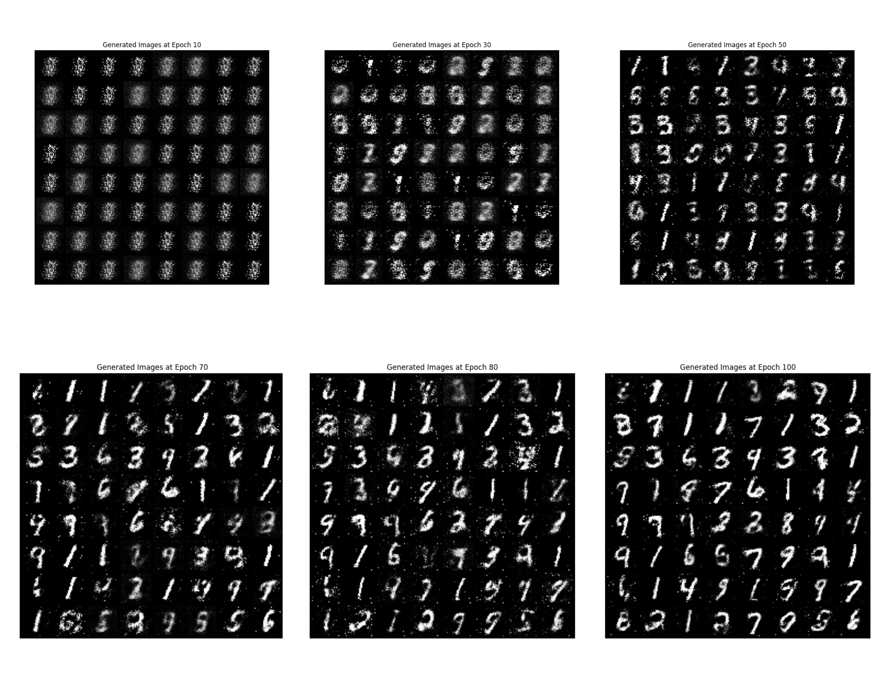

# Foundations of GAN


(_Update: 29/07/2025 22:43_)

This document provides a comprehensive overview of Generative Adversarial Networks (GANs), their mathematical foundations, and various implementations. It covers the motivation behind GANs, the process of generative modeling, and different types of GAN architectures including DC-GAN, Conditional GAN, and Wasserstein GAN.

This is a live document, and I will keep updating it as I implement more GANs.

### Table of Contents

- [Foundations of GAN](#foundations-of-gan)
  - [Motivation](#motivation)
  - [Goal](#goal)
  - [Initial Plan](#initial-plan)
  - [The 3-step Process of Generative Modelling](#the-3-step-process-of-generative-modelling)
  - [The Push-Forward Methods](#the-push-forward-methods)
  - [Impending Questions](#impending-questions)
- [Variational Divergence Minimisation](#variational-divergence-minimisation)
  - [f-divergence](#f-divergence)
  - [Algorithm for f-divergence minimization](#algorithm-for-f-divergence-minimization)
  - [Convex Conjugate](#convex-conjugate)
  - [Realisation of VDM](#realisation-of-vdm)
  - [Implementing VDM for Generative Sampling](#implementing-vdm-for-generative-sampling)
- [Generative Adversial Networks](#generative-adversial-networks)
  - [GAN Architecture](#gan-architecture)
  - [To Train Discriminator](#to-train-discriminator)
  - [To Train Generator](#to-train-generator)
  - [Implementation of GAN](#implementation-of-gan)
  - [Vanilla GAN - Recap](#vanilla-gan---recap)
  - [GAN as Classifier-Guided Generative Sampler](#gan-as-classifier-guided-generative-sampler)
- [Deep-Convolutional GAN](#deep-convolutional-gan)
  - [Implementation of DC-GAN](#implementation-of-dc-gan)
- [Conditional GAN](#conditional-gan)
  - [Implementation of Conditional GAN](#implementation-of-conditional-gan)
- [Wasserstien GAN](#wasserstien-gan)
  - [Wasserstein Metric [Optimal Transport]](#wasserstein-metric-optimal-transport)
  - [How to do Generative Modelling with Wasserstein Metric?](#how-to-do-generative-modelling-with-wasserstein-metric)
  - [Implementation of WGAN](#implementation-of-wgan)
- [Inversion with GAN](#inversion-with-gan)
  - [Approach 1: Bi-Directional GAN](#approach-1-bi-directional-gan)
  - [Latent Regression](#latent-regression)
- [Handling Domain-Shift](#handling-domain-shift)
  - [Unsupervised Domain Adaptation](#unsupervised-domain-adaptation)
- [Evaluation of Generative Models](#evaluation-of-generative-models)
  - [Frechet Inception Distance](#frechet-inception-distance)
- [Reference Papers](#reference-papers)

## Motivation

I've been given a sample data which is sampled i.i.d from a population. I intend to learn the parameters of the probability distribution of the population and then, _sample at will_.

## Goal

So, I can decompose my goal into:

1. Estimate the probability distribution of the population $\mathbb{P}_{\text{data}}$
2. Learn to sample from that estimate

# Initial Plan

Given,
${x_1, x_2, x_3, ..., x_n} \sim \mathbb{P}_{data}$ (unknown distribution)
I'll construct a $\mathbb{P}_{gen}$ and push $\mathbb{P}_{gen}$ towards $\mathbb{P}_{data}$

From hereon, I will refer $\mathbb{P}_{\text{data}}$ as $\mathbb{P}_{X}$ and $\mathbb{P}_{\text{gen}}$ as $\mathbb{P}_{\theta}$

Also, $\mathbb{P}$ refers to Distribution Function and $P$ refers to Probability Density Function

**Assumption**: Hereon, we shall solely use $P$ with the assumption that the _Distribution Functions_ we're dealing with have well-behaved _Density Functions_. [To make the calculations and math a little more easier]

> Density Function is not a probability. It is a tool to evaluate probability

## The 3-step Process of Generative Modelling

1. Assume a parametric family on $P_{X}$ denoted by $P_{\theta}$
   1. This $P_{\theta}$ is represented by Neural Networks
2. Define & Compute a divergence metric between the $P_{\theta}$ and $P_{X}$
   1. We don't know $P_{\theta}$ and $P_{X}$ though?
3. Solve an optimisation problem over the parameters of $P_{\theta}$ to minimise the above divergence metric

Chalo, Assume you'll somehow be able to compute the divergence metric between probability distributions that you don't even know, and also optimise them, how will you begin to think about how you'll sample from the estimated probability distribution?

## The Push-Forward Methods

Consider some arbitrary but known distribution $Z \sim N(0, I)$ and $g_{\theta}(z): Z \rightarrow X$, then $\tilde{X} = g_{\theta}(Z)$ has a different distribution than that of $Z$. So, if you end up constructing a $g_{\theta}$ that will produce a $\tilde{X}$ that has the same distribution or close to that of $P_{X}$, we are in the game.

\_Add the generator diagram here

## Impending Questions

1. How to compute the divergence metric without knowing $P_{\theta}$ and $P_X$?
2. What should be the choice of the divergence metric D?
3. How to choose the $g_{\theta}(z)$, in turn, $P_{\theta}$?
4. How to solve the optimisation problem of minimising the divergence metric?

# Variational Divergence Minimisation

_Define DIVERGENCE between distributions_

## f-divergence

Given 2 probability distribution functions with the corresponding density functions denoted by $P_X$ & $P_{\theta}$, the **f-divergence** between them is defined as follows:

$$
	D_f(P_X || P_{\theta}) = \int_{\chi} P_{\theta}(x)f{(\frac{P_{X}(x)}{P_{\theta}(x)})}
$$

$f(u): \mathbb{R}^{+} \rightarrow \mathbb{R}$, convex, left-semi continuous, and $f(1) = 0$
$\chi:$ $\text{space on which the}$ $P_X$ $\&$ $P_{\theta}$ $\text{are supported}$

**Properties of f-divergence**:

1. $D_f() \geq 0$, for any choice of $f()$
2. $D_f{(P_X || P_{\theta})} = 0$, if $P_X = P_{\theta}$

**Examples of f-divergence**:

- _KL Divergence_: $f(u) = u\text{log}u$

$D_f(P_X || P_{\theta}) = \int_{\chi} P_{\theta}(x) \frac{P_X(x)}{P_{\theta}(x)} \log{(\frac{P_X(x)}{P_{\theta}(x)})} dx = \int_{\chi} P_X(x) \log{(\frac{P_X(x)}{P_{\theta}(x)})} dx = D_{KL}$

$\overbrace{D_f(P_X || P_{\theta})}^{\text{Forward KL}} \neq \underbrace{D_f(P_{\theta} || P_X)}_{\text{Reverse KL}}$ | KL-Divergence is not symmetric

Difference choices of **f** functions result in different divergence metric with their own properties; which necessitates the need to look at swathes of divergence metrics.

- _JS Divergence_: $f(u) = \frac{1}{2}(u\text{log}u - (u+1)\text{log}(\frac{u+1}{2}))$ | Used Famously in **GAN**
- _Total Variational Distance_: $f(u) = \frac{1}{2}|u-1|$

### Algorithm for f-divergence minimization

**Objective**: Algorithm to minimise $D_f$ between $P_X$ and $P_{\theta}$, without knowing neither, but having samples from both.

_Samples from $P_X$_ - Dataset D
_Samples from $P_{\theta}$_ - Outputs of $g_{\theta}(z)$ for different $z$

But, without knowing $P_{\theta}(x)$ and $P_X(x)$, solving a high-dimensional integral is infeasible.

**Key Idea**: Integrals involving density functions can be approximated using samples from the distribution.

**The Law of Unconcisious Statistican**

Suppose we wanted to compute,

$$
I = \int_{\chi} h(x) P_{X}(x) dx
$$

where $h(x)$ is a function and $P_{X}(x)$ is the density function.

Also, suppose that we have samples drawn i.i.d from $P_X$

$x_1, x_2, x_3, ...., x_n \sim^{\text{i.i.d}} P_X$

$I = \mathbb{E}_{P_X}[h_x]$

**Law of Large Numbers**
$\underbrace{\lim_{n \rightarrow \infty} \frac{1}{n} \sum_{i=1}^{n} h(x_i)}_{x_i \sim^{\text{i.i.d}} P_X} = E_{P_X}[h(x)]$

_If the terms of the f-divergence can be expressed in terms of expectation of functions with respect to $P_X$ and $P_{\theta}$, then one can compute and optimise them\_

\*\*Expressing $D_f$ in terms of Expectations over $P_X$ and $P_{\theta}$

$D_f(P_X || P_{\theta}) = \int_{\chi} P_{\theta}(x)f{(\frac{P_{X}(x)}{P_{\theta}(x)})}$ <--- Even though this expression looks eerily similar to the integral form of the expectation, you cannot directly rewrite that expression in terms of expectation precisely because of the arguments of **f**. They aren't simply _"x"_, but instead are the ratio of probability density functions.

> Therefore, we somehow have to decouple the ratio of PDFs from 'f'

SLIGHT DETOUR

## Convex Conjugate

If $f(u)$ is a convex function, then there exists a conjugate function

$$
f^*(t) := \sup_{u \in \text{dom}(f)} {ut - f(u)}
$$

Essentially, we are lower-bounding $f(u)$ at every point _t_.

**Properties of Conjugate**

1. $f^*(t)$ is also convex
2. $[f^*(t)]^* = f(u)$ ==> $$f(u) = \sup_{t \in dom (f^*)} {tu - f^*(t)}$$
   DETOUR DONE

$D_f(P_X || P_{\theta}) = \int_{\chi} P_{\theta}(x)f{\underbrace{(\frac{P_{X}(x)}{P_{\theta}(x)})}_{u}} \,dx = \int_{\chi} P_{\theta}(x)f(u) \,dx$
$f(u) = \sup_{t} \{{tu - f^*(t)}\}$

$D_f(P_X || P_{\theta}) = \int_{\chi} P_{\theta}(x) \sup_{t} \{{tu - f^*(t)}\} \,dx$

$D_f(P_X || P_{\theta}) = \int_{\chi} P_{\theta}(x) \sup_{t} \{{t[\frac{P_{X}(x)}{P_{\theta}(x)}] - f^*(t)}\} \,dx$

$= \sup_{T(X) \in \mathcal{T}} \int_{\chi} P_{\theta}(x) \{{T(X)[\frac{P_{X}(x)}{P_{\theta}(x)}] - f^*(T(X))}\} \,dx$

The inner optimisation problem involves $X$ & the solution for it is dependent (a function of $X$)

$\mathcal{T}: X \rightarrow dom(f^*)$
$T(X) \in \mathcal{T}$

But,

$$D_f \geq \sup_{T(X) \in \mathcal{T}} \int_{\chi} P_{\theta}(x) \{{T(X)[\frac{P_{X}(x)}{P_{\theta}(x)}] - f^*(T(X))}\} \,dx$$

because the space of functions $\mathcal{T}$ that we are optimising over may not contain the optimal $T^*(x)$, that is the solution for the inner optimisation problem.

$$
\geq \sup_{T(X)} \int_{\chi} {P_{X}(x)}T(X)\,dx - \int_{\chi} {P_{\theta}(x)}f^*(T(X))\,dx
$$

$$
\geq \sup_{T(X)} \{\mathbb{E}_{P_{X}}T(X) - \mathbb{E}_{P_{\theta}}f^*(T(X))\}
$$

## Realisation of VDM


We set out to solve ---> $\theta^* = \mathop{\arg\min}_{\theta} D_f(P_X || P_{\theta})$

But we are relegated to solve $\theta^* = \mathop{\arg\min}_{\theta} [\text{lower bound on }D_f]$ and that's the best we can do.

$$
= \mathop{\arg\min}_{\theta} [\sup_{T(X)} \{\mathbb{E}_{P_{X}}T(X) - \mathbb{E}_{P_{\theta}}f^*(T(X))\}]
$$

Calculating the supremum with respect to a class of functions $T(X) \in \mathcal{T}$ cannot be done analytically (?), since it is an optimisation procedure over a space of non-trivial functions.

In practice, we represent $\mathcal{T}$ via neural networks: $T_w(X)$, where **w** are the parameters of the neural network.

With this, the objective will become:

$$
\theta^*, w^* = \mathop{\arg \min}_{\theta} \max_{w}[\mathbb{E}_{P_{X}}T_w(X) - \mathbb{E}_{P_{\theta}}f^*(T_w(X))]
$$

## Implementing VDM for Generative Sampling


$$
J(\theta, w) = [\mathbb{E}_{P_{X}}T_w(X) - \mathbb{E}_{P_{\theta}}f^*(T_w(X))]
$$

$$
\underbrace{(\theta^*, w^*) = \mathop{\arg \min}_{\theta} \max_{w} J(\theta, w)}_{\text{Saddle-Point Optimisation Problem}}
$$

This, essentially, is the **Blueprint for Adversial Training**

Any _saddle point optimisation problem_ is also a _adversial optimisation problem_.

We know, by construction, $T(): X \rightarrow dom(f^*)$ ---> Depending on the choice of $f^*$, we need to tweak the **T** network so that the range of **T** network corresponds to domain of $f^*$ ---> In practice, we do this by representing $T_w(X)$ as $\sigma_f(V_w(X))$, where $\sigma_f$ is a f-divergence specific activation

$V_w(X): X \rightarrow \mathbb{R}$, $\sigma_f(v): \mathbb{R} \rightarrow dom{f^*}$

This means the **T** network that we'll approximate using neural networks is represented as a composition of 2 functions.


_The Discriminator as the composition of 2 functions will go here_

$$
J(\theta, w) = [\mathbb{E}_{P_{X}}\sigma_f{V_w(x)} - \mathbb{E}_{P_{\theta}}f^*(\sigma_f{V_w(x)})]
$$

# Generative Adversial Networks

**_A Special Case of VDM Algorithms_**

The choice of f-divergence: $\overbrace{u\log u - (u+1) \log(u+1)}^{\text{Awfully similar to JS Div.}}$

$f^*(t) = -\log(1 - e^t)$ and $dom(f^*) = \mathbb{R^-}$
$\sigma_f(v) = -\log(1 + e^{-v})$

$$
J_{GAN}(\theta, w) = \mathbb{E}_{P_X}[\log D_w(X)] + \mathbb{E}_{P_{\theta}}[\log(1 - D_w(X))]
$$

where $D_w(X) = \frac{1}{1 + e^{-V_w(X)}}$


**Exercise**
Derive the above $J_{GAN}$ using the given _f_

## GAN Architecture


_The Generator and Discriminator go here_

$$
J_{GAN}(\theta, w) = \mathbb{E}_{x \sim P_X}[\log D_w(x)] + \mathbb{E}_{\hat{x} \sim P_{\theta}}[\log(1 - D_w(\hat{x}))]
$$

Assume, $\{x_1, x_2, ..., x_{B_1}\} \sim P_X$ and $\{\hat{x_1}, \hat{x_2}, ..., \hat{x_{B_2}}\} \sim P_{\theta}$

### To Train Discriminator


_Keep $\theta$ constant_

$B_1 = \{x_1, x_2, ..., x_{B_1}\} \subset D$ | Sample $z_1, z_2, ..., z_{B_2}$ & Pass $z_1, z_2, ..., z_{B_2}$ through $g_{\theta}()$ with fixed $\theta$

$$
J_{GAN} = \frac{1}{B_1} \sum_{i=1} \log D_w(x_i) + \frac{1}{B_2} \sum_{j=1} \log 1 - D_w(\hat{x_j})
$$

$$
w^* = \mathop{\arg \max}_{w} J_{GAN}(\theta, w)
$$

$w^{t+1} \leftarrow w^{t} + \alpha_1 \nabla_{\theta}J_{GAN}(\theta, w)$

Backpropogate the gradients all the way to the inputs of the discriminator

**Exercise:** What is the behaviour of $D(x)$ if $P_{\theta}(x) = P_X(x)$?

### To Train Generator


$$
J_{GAN} = \frac{1}{B_2} \sum_{j=1} \log 1 - D_w(g_{\theta}(z_j))
$$

To update the parameters of the generator, we do not need the samples from the data.

$$
\theta^* = \mathop{\arg \min}_{\theta} J_{GAN}(\theta, w)
$$

$\theta^{t+1} \leftarrow \theta^{t} - \alpha_2 \nabla_{\theta}J_{GAN}(\theta, w)$

_Typically, alternate between 1-step of Generator and 1-step of Discriminator whilst training_

## Implementation of GAN

```python
class Generator(nn.Module):
  def __init__(self, noise_dim, img_dim):
    super(Generator, self).__init__()
    self.model = nn.Sequential(
        nn.Linear(noise_dim, 256),
        nn.ReLU(True),
        nn.Linear(256, 512),
        nn.ReLU(True),
        nn.Linear(512, 1024),
        nn.ReLU(True),
        nn.Linear(1024, img_dim),
        nn.Tanh() # Because we normalized images to [-1, 1]
    )

  def forward(self, z):
    return self.model(z)
```

```python
class Discriminator(nn.Module):
  def __init__(self, img_dim):
    super(Discriminator, self).__init__()
    self.model = nn.Sequential(
        nn.Linear(img_dim, 512),
        nn.LeakyReLU(0.2, inplace=True),
        nn.Linear(512, 256),
        nn.LeakyReLU(0.2, inplace=True),
        nn.Linear(256, 1),
        nn.Sigmoid() # Outputs probability between 0 and 1
    )

  def forward(self, img):
    return self.model(img)
```

```python
def train_gan(train_loader, num_epochs:
  fixed_noise = torch.randn(64, noise_dim).to(device)

  for epoch in range(num_epochs):
    for batch_idx, (real, _) in enumerate(train_loader):
      batch_size = real.size(0)
      real = real.view(batch_size, -1).to(device)

      ### Create Real and Fake Labels
      real_labels = torch.ones(batch_size, 1).to(device)
      fake_labels = torch.zeros(batch_size, 1).to(device)

      ### ==================================
      ### Train Discriminator: max log(D(x)) + log(1 - D(G(z)))
      ### ==================================

      # Real Images
      outputs = discriminator(real)
      d_loss_real = criterion(outputs, real_labels)
      real_score = outputs

      # Fake Images
      z = torch.randn(batch_size, noise_dim).to(device)
      fake = generator(z)
      outputs = discriminator(fake.detach())
      d_loss_fake = criterion(outputs, fake_labels)
      fake_score = outputs

      # Total Loss
      d_loss = d_loss_real + d_loss_fake

      # Backprop
      d_optimizer.zero_grad()
      d_loss.backward()
      d_optimizer.step()

      ### ================================
      ### Train Generator: min log(1 - D(G(z))) <-> max log(D(G(z))
      ### ================================
      # Generate fake images again
      z = torch.randn(batch_size, noise_dim).to(device)
      fake = generator(z)
      outputs = discriminator(fake)

      g_loss = criterion(outputs, real_labels) # trick discriminator

      # Backprop
      generator.zero_grad()
      g_loss.backward()
      g_optimizer.step()

      if (epoch + 1) % 10 == 0:
		print(f"Epoch [{epoch+1}/{num_epochs}], D_loss: {d_loss.item():.4f}, G_loss {g_loss.item():.4f}")
		show_generated_images(epoch+1, generator, fixed_noise)
```



# Vanilla GAN - Recap

**Input**: D = $\{x_1, x_2, ..., x_n\} \sim^{\text{i.i.d}} P_X$
**Data**: $\text{MNIST}_{28\texttimes28}$


**Loss Function**

$$
J(\theta, w) = \mathbb{E}_{P_X}[\log D_w(x)] + \mathbb{E}_{P_{\theta}}[1 - \log D_w(x)]
$$

_Approximate expectation using Sample Mean and use Batches_

$$
J(\theta, w) = \frac{1}{B_1} \sum_{i=1}^{B_1} \log D_w(x_i) + \frac{1}{B_2} \sum_{j=1}^{B_2} \log 1 - D_w(\hat{x_j})
$$

$x_1, x_2, ..., x_{B_1} \sim^{\text{i.i.d}} P_x$
$\hat{x_1}, \hat{x_2}, ..., \hat{x_{B_2}} \sim^{\text{i.i.d}} P_{\theta}$

$$
J(\theta, w) = \frac{1}{B_1} \sum_{i=1}^{B_1} \log D_w(x_i) + \frac{1}{B_2} \sum_{j=1}^{B_2} \log 1 - D_w(g_{\theta}(z_j))
$$

$z_1, z_2, ..., z_{B_2} \sim^{\text{i.i.d}} N(0, I)$

### Discriminator N/W:

$$
w^* = \mathop{\arg \max}_{w} \frac{1}{B_1} \sum_{i=1}^{B_1} \log D_w(x_i) + \frac{1}{B_2} \sum_{j=1}^{B_2} \log 1 - D_w(g_{\theta}(z_j))


$$

$$
w^{t+1} \leftarrow w^t + \alpha_1 \nabla_{w}J(\theta, w)
$$

While training the discriminator the parameters of the generator network are kept constant.

1. Sample $z_1, z_2, ..., z_{B_2} \sim^{\text{i.i.d}} N(0, I)$
2. Pass them through $g_{\theta}(z)$ to obtain $g_{\theta}(z_1), g_{\theta}(z_2), ..., g_{\theta}(z_{B_2})$
3. Pass these through $D_w(.)$ and obtain the $2nd$ term in loss
4. Get $x_1, x_2, ..., x_{B_1} \sim P_x$
5. Pass these through $D_w(.)$ and get the 1st term in loss
6. TOTAL LOSS = TERM 1 + TERM 2

This is how the gradient ascent is implemented for the discriminator network.

### Generator N/W:

$$
\theta^* = \mathop{\arg \min}_{\theta} \overbrace{\frac{1}{B_1} \sum_{i=1}^{B_1} \log D_w(x_i)}^{\text{Independent of } \theta} + \frac{1}{B_2} \sum_{j=1}^{B_2} \log 1 - D_w(g_{\theta}(z_j))


$$

$$
\theta^{t+1} \leftarrow \theta^t + \alpha_2 \nabla_{\theta}J(\theta, w)
$$

While training the generator the parameters of the discriminator network are kept constant.

# GAN as Classifier-Guided Generative Sampler

$D = \{x_1, x_2, ..., x_n\} \sim^{\text{i.i.d}} P_X$

**Goal:** $P_{\theta}(\hat{x})$ to be close to $P_X$

Suppose there's a binary classifier,

$$
D_w(X) =
\begin{cases}
1 \text{ if } x \sim P_X \\
0 \text{ if } x \sim P_{\theta}
\end{cases}
$$

$D_w(X)$ is a binary classifier between the samples of $P_X$ and $P_{\theta}$

**Question**: Can $D_w(X)$ be used to make $P_X$ and $P_{\theta}$ closer?
**Answer**: Yes. Tweak $\theta$ till the classifier fails to distinguish between the samples of $P_X$ and $P_{\theta}$

However, Failure of the classifier need not imply $P_X = P_{\theta}$ (A counter example supporting this statement can be easily formed)

**Solution**: Keep altering the classifier along with the data (pretty intuitive)

**Natural Question**: What if the data clusters just cycles around 2 positions? We may get stuck!!!

This is Possible. It's called **MODE COLLAPSE**, a failure mode in _GANs_

## Formulation

Suppose, $D_{w}: X \rightarrow [0, 1]$
Let $D_w(X)$ represent the likelihood of sample $X$ coming from $P_X$

The objective is to maximise the log-likelihood of $X$ coming from $P_X$

$$
w^* = \mathop{\arg \max}_{w}[\mathbb{E}_{P_X} \log D_w(x)]
$$

_Maximising the likelihood of $X \sim P_X$_

Classifier should also maximise the likelihood of $\hat{X}$ not coming from $P_X$, when $\hat{X} \sim P_{\theta}$

$$
w^* = \mathop{\arg \max}_{w}[\mathbb{E}_{\hat{X} \sim P_{\theta}} \log[1 - D_w(x)]]
$$

_Maximising the likelihood of $\hat{X} \not\sim P_X$_

**The Combined Objective For Classifier Training**

$$
w^* = \mathop{\arg \max}_{w}[\mathbb{E}_{X \sim P_X} \log D_w(x) + \mathbb{E}_{\hat{X} \sim P_{\theta}} \log[1 - D_w(x)]]
$$

Same as the loss-function we've obtained in the VDM.

**The Objective for The Generator**

_It's job is to make the classifier "fail"_

Invert the optimisation for the classifier

$$
\theta^* = \mathop{\arg \min}_{\theta} J(\theta, w)
$$

$$
\theta^*, w^* = \mathop{\arg \min}_{\theta} \max_{w} J(\theta, w)
$$

This classifier-guided interpretation of GAN is not generalizable across other f-divergences.
Because, there's no guarantee that the **T** function we use to bound the _f-div_ has the interpretation that **T**-function is a classifier. Only with this particular choice of f-divergence do we have that interpretation.

# Deep-Convolutional GAN

Typically, in a GAN, $\mathcal{Z} \in \mathbb{R}^{k}, X \in \mathbb{R}^d, k << d$


In a DC-GAN, Upconvolution (or transpose convolutional) layers are used in the generator.
In DC-GAN, data is images

## Implementation of DC-GAN

# Conditional GAN

**Data D**: $\{(x_1, y_1), (x_2, y_2), ..., (x_n, y_n)\} \sim^{\text{i.i.d}} P_{XY}$
**Example:** $X$ : Images, $Y$ : class-label / textual embedding

**Objective**: Sample from conditional distribution $P_{X | Y}$ instead of $P_X$ (Naive GAN)

**Solution**: Estimate $P_{X | Y}$ and make $P_{\theta}$ approach $P_{X | Y}$ $\forall y$

Modify the generator & discriminator to operate on the samples of conditional distribution.


$$
J(\theta, w) = \mathbb{E}_{x, y \sim P_{X | Y}}[\log D_w(x, y)] + \mathbb{E}_{\hat{x}, y \sim P^{\theta}_{\hat{X} | Y}}[1 - \log D_w(\hat{x}, y)]
$$

## Implementation of Conditional GAN

# Wasserstien GAN

**Motivation for the Need**

1. The saddle point optimisation problem is difficult
2. Any f-divergence minimisation leads to unstable training

**Question**: What makes GAN training difficult and unstable?

### Manifold Hypothesis

The data we observe in the wild reside in a very low-dimensional manifold in the ambient space $(\mathbb{R}^d)$

_Example_
$${\text{pixel}}  \begin{array} {|r|r|} \hline 0 & 1 & 1 & 0 & 0 \\ \hline 1 &  &  &  &  \\ \hline  &  &  &  &  \\ \hline  &  &  &  &  \\ \hline  &  &  &  &  \\ \hline  \end{array}$$
Consider this 5 x 5 image with $P_{ij} = 1$ if toss is heads & vice-versa.
The likelihood that an image generated by the above process resembles a real-world image is very low.

Therefore, it can be posited that real data exists on a lower dimensional manifolds.

Consequently, the supports of $P_X$ and $P_{\theta}$ will not be aligned with a very high probability.

It can be shown that a **Perfect Discriminator** can be learned when the supports of $P_X$ and $P_{\theta}$ are not aligned.

==> _The GAN Training Saturates_: **Perfect Discriminator Theorem**
For a perfect discriminator, the gradients flowing to generator nullify. Alternatively, it can be said that the lower bound on the loss is not tight, therefore minimising it would not make sense.

When we have a _perfect discriminator_ ---> the $D_f(P_x || P_{\theta})$ becomes independent of ${\theta}$  
---> this causes saturation ---> Since, the gradients won't flow to the generator, you wouldn't be able to tweak the $\theta$ to make the generated data align with real data, effectively.

_1 Empirical Solution_ is to not train them equally.
_1 Principled Solution_ is to use a softer divergence metric that does not saturate when the manifolds of the supports of $P_X$ and $P_{\theta}$ do not align.

## Wasserstein Metric [Optimal Transport]

**Idea**: We will show that the Wasserstein metric will not saturate and won't become independent of generator's metrics, despite the manifold of supports not aligning.

Given 2 distributions, $P_X$ & $P_{\theta}$

$$
W(P_X || P_{\theta}) = \min_{\lambda \in \Pi(X, \hat{X})} \mathbb{E}_{x, \hat{x} \sim \lambda} || x - \hat{x}||^2
$$

$\lambda: \text{joint distribution between } P_X, P_{\hat{X}}$
$\Pi(X, \hat{X})$: All possible joint distributions such that $\int_x \Pi(x, \hat{x}) \,dx = P_{\hat{x}}$ & $\int_{\hat{x}} \Pi(x, \hat{x}) \,d\hat{x} = P_{x}$

_Example_: Suppose $P_X$ and $P_{\hat{X}}$ are two _1-d_ discrete PMF.


The mass in $P_X$ can be redistributed such that $P_X$ transforms into $P_{\hat{X}}$
A _redistribution scheme_ can be represented as a joint distribution between $P_X$ and $P_{\hat{X}}$

_Joint Distribution between $P_X$ and $P_{\hat{X}}$\_

$$
\begin{array}{c|lcr}
 & \hat{x_1} & \hat{x_2} & ... & \hat{x_L} \\
\hline
x_1 & 0.3 & 0.2 & ... & 0.1 \\
x_2 &  &  & ... & \\
. & . & . & . &.\\
. & . & . & . &.\\
x_k &  &  & ... &
\end{array}
$$

Every redistribution scheme is a joint distribution and it is called a transport plan.

**Next Goal**:

Quantify the effort involved in a transport plan.

Suppose some mass is moved from $X$ and $\hat{X}$, then $$||X - \hat{X}||_2: \text{Distance of the Movement of Mass}$$

$$
\Pi(X, \hat{X}): \text{Amount of mass that was moved}
$$

$$
||X - \hat{X}||_2  \Pi(X, \hat{X}): \text{Work done in moving the Mass from } X \rightarrow \hat{X}
$$

Any work done in a transport plan:

$$
\int_{X, \hat{X}} ||x - \hat{x}||_2  \Pi(x, \hat{x}) \,dx \,d\hat{x}
$$

$$
\mathbb{E}_{\Pi(x, \hat{x})} ||x - \hat{x}||_2
$$

> \_Why are we doing this? We are in search of metric that tells us the work needed to move one distribution to another.

Given that multiple transport plans (Joint Distributions) exist between $X$ and $\hat{X}$, which of them would correspond to least amount of work done?

$$
\min_{\lambda \in \Pi(X, \hat{X})} \mathbb{E}_{\lambda(x, \hat{x})} ||x - \hat{x}||_2
$$

This corresponds to the transport plan leading to the least amount of work done.

The closer the $P_X$ and $P_{\hat{X}}$ are the lesser the amount of work needed by the transport plan.

### Wassertstein's Metric between 2 distributions $P_X$ and $P_{\hat{X}}$ is given by:

$$
W_{p}(P_x || P_{\hat{X}}) = \min_{\lambda \in \Pi(X, \hat{X})} \mathbb{E}_{\lambda(x, \hat{x})} ||x - \hat{x}||_p, \text{where } \int_{\hat{X}} \Pi(X, \hat{X}) \,d\hat{X} = P_{X} \text{ and vice-versa}
$$

**Fact | Take-Home Message**: Wasserstein's Metric does not saturate unlike f-divergences, when supports of $P_X$ and $P_{\theta}$ does not overlap

## How to do Generative Modelling with Wasserstein Metric?


$\theta^* = \mathop{\arg \min}_{\theta} W(P_X || P_{\theta})$ ---> How to minimise? ---> Cue the _Kantrovich-Rubenstein Duality_

$$
W(P_X || P_{\theta}) = \max_{\underbrace{||T_w(X)||_{L} < 1}_{\text{1-Lipschitz}}}[\mathbb{E}_{x \sim P_x}T_w(X) - \mathbb{E}_{\hat{x} \sim P_{\theta}}T_w(\hat{x})]
$$

$$
||T_w(X)||_{L} < 1: \text{1-Lipschitz}
$$

==> A function is $\text{1-Lipschitz}$ if it's rate of change is bounded by 1.

$$
\frac{||T_w(x_1) - T_w(x_2)||}{||x_1 - x_2||} \leq 1
$$

AKA: _Bounded Derivatives_

$$
\theta^*, w^* = \mathop{\arg \min}_{\theta} \max_{||T_w||_L < 1} [\mathbb{E}_{x \sim P_x}T_w(X) - \mathbb{E}_{\hat{x} \sim P_{\theta}}T_w(\hat{x})]
$$

The above objective is very similar to GANs. Thus, the above method of minimising the wasserstein metric is called W-GAN.


$T_w(X)$ has to be made $\text{1-Lipschitz}$ ---> How to achieve this is a research topic in itself
---> 1 Practical way to achieve this ---> Normalise the weights of $T_w$ such that $||w||_2 = 1$ after each gradient step.

**CONCLUSION**: It is observed that training W-GAN is more stable compared to that of Naive GAN.

## Implementation of WGAN

# Inversion with GAN

A trained GAN is a function $Z \rightarrow X$. Suppose one is interested in inversion of the above function,i.e, given $x_i \sim P_x$, find the corresponding $Z$ ---> $z_i: g_{\theta}(z_i) = x_i$

**Question**: How to modify a GAN such that the inverse is possible?

First off, _why is it worthy of our attention?_

1. _Feature Extraction_: Given a dataset obtain GAN-inverted vectors and use them as features for data. They, then, can be used for downstream tasks.
2. _Data Manipulation & Editing_: Suppose $x_i \sim P_x$ needs to be edited. First, obtain $x_i = g_{\theta}^*(z_i)$ via inversion. Then, $z_{\text{edit}}  = f_{\text{edit}}(z_i)$ & $x_{\text{edit}} = g_{\theta}^*(z_{\text{edit}})$

## Approach 1: Bi-Directional GAN

In a Naive-GAN,
$$g_{\theta}(z):Z \rightarrow X$$
$$D_w(x): X \rightarrow [0, 1]$$

In **_Bi-GAN_**, in addition to $g_{\theta}(z)$ & $D_w(x)$, there is another function called the _Encoder_ or the _Invertor_ network ---> $E_{\phi}: \chi \rightarrow Z$


In _Bi-GAN_, the $D_w()$ is designed to classify between the data tuples of the form $$ [X,E_{\phi}(X)] \text{ and } [g_{\theta}(Z), Z] $$, where $X \sim P_X$, $E_{\phi}(X) \sim P_{\phi}(\hat{Z}), Z \sim N(0, I), g_{\theta}(Z) \sim P_{\theta}$

In a Naive-GAN, $D_w()$ classifies between $$ X \text{ and } g\_{\theta}(Z) $$

$$
L_{\text{Bi-GAN}}(\theta, w, \phi) = \mathop{\mathbb{E}}_{x \sim P_x}[\mathop{\mathbb{E}}_{\hat{z} \sim P_{\phi}} \log D_w(x, E_{\phi}(x))] + \mathop{\mathbb{E}}_{z \sim P_z}[\mathop{\mathbb{E}}_{\hat{x} \sim P_{\theta}} \log \{1 - D_w(g_{\theta}(z), z)\}]
$$

$$
\hat{Z} = E_{\phi}(x) \sim P_{\phi}(Z), \hat{X} = g_{\theta}(Z) \sim P_{\theta}(\hat{X}), Z \sim P_z = N(0, I)
$$

### Objective Function for BiGAN

$$
\mathop{\min_{\theta, \phi}} \mathop{\max_{w}} L_{\text{Bi-GAN}}(\theta, w, \phi)
$$

Once a **Bi-GAN** is trained, the generator network $g_{\theta}^*(z)$ is used for generation & $E_{\phi}^*(x)$ is used for inversion.

It can be shown that the optima of $L_{\text{Bi-GAN}}$ is achieved when $P_{\hat{Z}X} = P_{Z\hat{X}}$, where $$ P*{\hat{Z}X} = \int_xP_x\int*{\hat{z}}P*{\phi}(\hat{z} | x).d{\hat{z}}.dx$$ $$ P*{Z\hat{X}} = \int*zP_z\int*{\hat{x}}P\_{\theta}(\hat{x} | z).d{\hat{x}}.dz$$

### Implementation of BiGAN

## Latent Regression


$$
L_{\text{Lat-Reg}} = [\mathop{\mathbb{E}}_{x \sim P_x} \log D_w(x) + \mathop{\mathbb{E}}_{\hat{x} \sim P_{\theta}} \log \{1 - D_w(\hat{x})\}] + \lambda ||z - E_{\phi}(\hat{x})||_2^2
$$

# Handling Domain-Shift

**You made a classifier in Delhi. Want to use in Boston. How to make it robust to that change?** _By extracting domain-invariant features_

Suppose we have data from a distribution,

$$
D_{S} = \{(x_1, y_1), (x_2, y_2), ..., (x_n, y_n)\} \mathop{\sim}^{\text{i.i.d}} P_S
$$

$D_S$: Source Distribution

**Task**: _Classification_, Estimate $P_S(y | x)$

During test-time, data comes from a different distribution. $D_T$ that is different from $D_S$

$$
D_T \neq D_S
$$

Classifiers / Regressors trained on $D_S$ would fail on $D_T$ [PACS Dataset]

## Unsupervised Domain Adaptation

Given $$D_S = \{(x_i, y_i)\}_{i=1}^n \mathop{\sim}^{\text{i.i.d}} P_S$$$$D_T = \{(\hat{x_j})\}_{j=1}^m \mathop{\sim}^{\text{i.i.d}} P_T$$$$P_S \neq P_T$$ (Domain-Shift)

**Objective**: Given $D_S$ & $D_T$, learn features/classifier such that it performs well on both source and target data

**Solution**: _Domain Adversial Networks_

$\phi: \chi \rightarrow F$ | $\phi(x) = f_S$ & $\phi(\hat{x}) = f_T$
$f_S \sim P_{f_S}$
$f_T \sim P_{f_T}$


$$
\theta^*, w^* = \arg \mathop{\min}_{\phi} \mathop{\max}_{w} {\mathop{\mathbb{E}}_{P_{f_S}} \log D_w(f_S) + \mathop{\mathbb{E}}_{P_{f_T}} \log D_w(f_T)}
$$

$$
\theta^*, \psi^* = \arg \mathop{\min}_{\psi} BCE(y, h_{\psi}(f_S))
$$

The $\phi$-network has 2 objectives

1. Adversial Objective
2. Classification Objective

If we solely train the generator for the adversial objective, we may solve for the task of producing same representations for data points with same meaning well, but the produced representation may not be conducive for the classification task.

During _inference_, the same classifier can be used on both the source and target distributions, since the classifier is trained on domain-agnostic features.

Given,

$$
\begin{aligned}
\hat{x}_{\text{test}} \sim P_T \\
f_t^{\text{test}} = \phi^*(\hat{x}_{\text{test}}) \\
\hat{y}_{\text{test}} = h_{\psi^*}(f_t^{\text{test}})
\end{aligned}
$$

Since $\phi$ would ensure that $P_{f_S} = P_{f_T}$, $h_{\psi^*}$ will function the same way irrespective of domain.

### Implementation of UDA

# Evaluation of Generative Models

Given $D_{\text{true}} = \{x_1, x_2, x_3, ..., x_n\} \mathop{\sim}^{\text{i.i.d}} P_x$ (Real Data), $D_{\text{gen}} = \{\hat{x_1}, \hat{x_2}, ..., \hat{x_n}\} \mathop{\sim}^{\text{i.i.d}} P_{\theta^*}$ (Generated Data)

\*\*Goal: Compare $D_{\text{true}}$ & $D_{\text{gen}}$

A popular metric to do that comparison is _Frechet Inception Distance_

## Frechet Inception Distance

**FID**: Wassertstein's Metric between $D_{\text{true}}$ & $D_{\text{gen}}$ _with a twist_.

1. Take a pretrained inception net, trained on Image-Net.
2. Pass $D_{\text{true}}$ & $D_{\text{gen}}$ through the above inception network


Extract the features for $D_{\text{true}}$ & $D_{\text{gen}}$ from an $l^{\text{th}}$ layer of $I_{\psi^*}(x)$

$$
\begin{gathered}
\hat{D}_{\text{true}} = \{ Z^1_{\text{true}}, Z^2_{\text{true}}, ..., Z^n_{\text{true}} \}
\hat{D}_{\text{gen}} = \{ Z^1_{\text{gen}}, Z^2_{\text{gen}}, ..., Z^n_{\text{gen}} \} \\
Z_{\text{true}}^i = \text{Output of } l^{th} \text{ layer of }I_{\psi^*}(x) \\
Z_{\text{gen}}^i = \text{Output of } l^{th} \text{ layer of }I_{\psi^*}(x)
\end{gathered}
$$

3. Compute Mean and Co-Variances for $\hat{D}_{\text{gen}}$, $\hat{D}_{\text{true}}$

   $$
   \begin{gathered}
   \mu_{\text{true}} = \frac{1}{n} \sum_{i=1}^n Z_{\text{true}}^i \\
   \Sigma_{\text{true}} = \frac{1}{n} \sum_{i=1}^n Z_{\text{true}}^i(Z_{\text{true}}^i)^T
   \end{gathered}
   $$

   Similarily, compute $\mu_{\text{gen}}$ & $\Sigma_{\text{gen}}$

4. Assume, $$\begin{aligned} Z_{\text{true}} \sim N(\mu_{\text{true}}, \Sigma_{\text{true}}) \\ Z_{\text{gen}} \sim N(\mu_{\text{gen}}, \Sigma_{\text{gen}}) \end{aligned}$$
5. **FID** = $W(N(\mu_{\text{true}}, \sigma_{\text{true}}) || N(\mu_{\text{gen}}, \sigma_{\text{gen}}))$ = $||\mu_{\text{true}} - \mu_{\text{gen}}||^2 + tr(\sigma_{\text{true}} + \sigma_{\text{gen}} - 2(\sigma_{\text{true}} \sigma_{\text{gen}})^{\frac{1}{2}})$

The Generative Model is better if **FID** is lower.

Lower _FID_ ==> lower _Wasserstein_ distance between $P_X$ and $P_{\theta^*}$

# Reference Papers

1. GAN Paper: https://arxiv.org/pdf/1406.2661
2. f-GAN Paper: https://arxiv.org/pdf/1606.00709
3. Conditional GAN Paper: https://arxiv.org/pdf/1411.1784
4. DC-GAN Paper: https://arxiv.org/pdf/1511.06434
5. W-GAN Paper: https://arxiv.org/pdf/1701.07875
6. BiGAN Paper: https://arxiv.org/pdf/1605.09782
